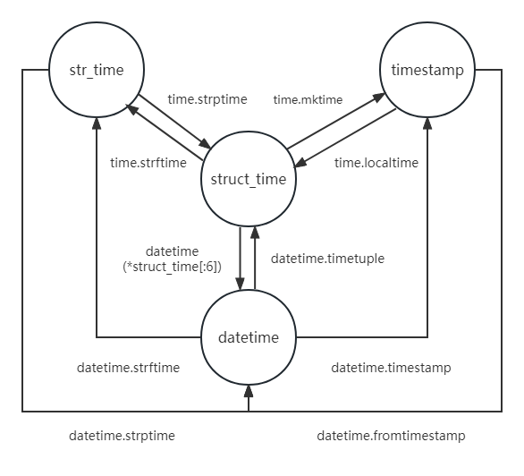

# Python时间关系转换
---
目前了解到python有四种格式，时间戳的timestamp，字符串表示的str_time，Python元组表示的struct_time，日期计算的datetime

```
time_stamp =  time.time() 
1686235670.569275

struct_time =  time.localtime()
time.struct_time(tm_year=2023, tm_mon=6, tm_mday=8, tm_hour=22, tm_min=47, tm_sec=50, tm_wday=3, tm_yday=159, tm_isdst=0)

str_time = "2023-06-08 22:47:50"

date_time = datetime.now()
2023-06-08 22:47:50.569275


#struct_time timestamp
struct_time = time.localtime(time_stamp)
time_stamp = time.mktime(struct_time)

#struct_time str_time
struct_time = time.strptime(str_time,'%Y-%m-%d %H:%M:%S')
str_time = time.strftime('%Y-%m-%d %H:%M:%S',struct_time)

#struct_time date_time
struct_time = date_time.timetuple()
date_time = datetime(*struct_time[:6])

#date_time timestamp
date_time = datetime.fromtimestamp(time_stamp)
time_stamp = date_time.timestamp()

#date_time str_time
date_time = date_time.strptime(str_time,'%Y-%m-%d %H:%M:%S')
str_time = datetime.strftime("%Y-%m-%d %H:%M:%S")
```
